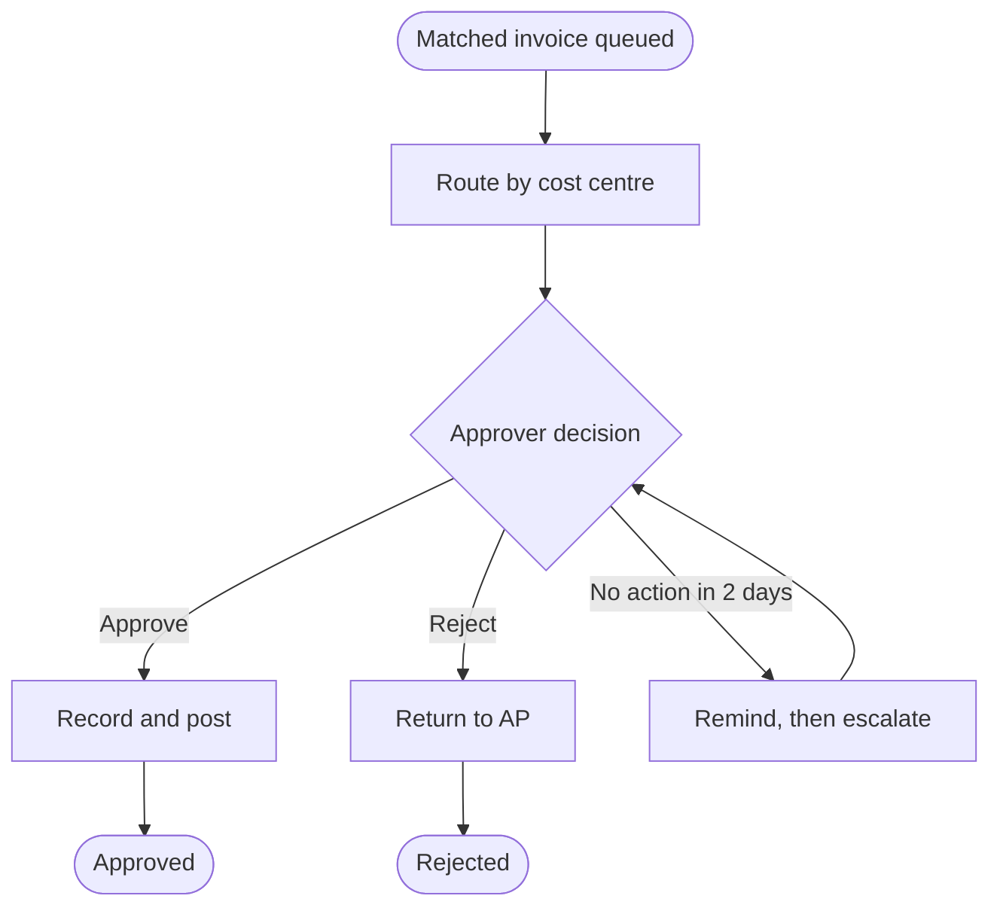

# Process Model

> **How to use this template.** Filled rows and "Example" lines illustrate one scenario so the expected depth is clear. Replace them with the facts of the work at hand: never carry example names, figures, or IDs into a real document, and say plainly when a fact is not yet known. Include every other section by default, and leave one out only when the user asks. Include these sections only when their condition applies or the user asks for them: Diagram (written for executive readers or customers, or the Business Process Management perspective); Process metrics (the Business Process Management or Business Intelligence perspective); Controls and compliance (regulated work). The full rules are in `templates/process-model.toc.json`.

## Purpose

Document a business process so it is visible, analysable, and ready to improve or specify. Captures the boundary (SIPOC), the current-state flow, the analysis, and the future-state flow, in a notation used correctly. Based on Process Modelling and Process Analysis. Graded by `evaluation/process-model-rubric.md`.

This template is a superset. Its table-of-contents manifest, `templates/process-model.toc.json`, marks which sections are core, standard, or extended and when each applies.

## Document Control

| Field | Value |
| --- | --- |
| Process | Approve supplier invoice (PM-002) |
| Business analyst | Omar Haddad |
| Process owner | AP manager |
| Version | 1.2.0 |
| Status | Validated with AP |

## Scope

State the process boundary: where it starts and ends, and what is outside it. The SIPOC below makes the boundary explicit.

Example: from a matched invoice arriving in the approval queue to the approval status posted in the ERP. Matching and payment runs are outside.

## Inputs

List the evidence the model rests on: observation, interviews, system logs, and procedures.

Example: observation of four clerks on 2026-05-06; approval cycle-time log, January to April; procedure AP-PR-04.

## SIPOC

Frame the boundary before detailing the flow.

| Suppliers | Inputs | Process (5 to 7 steps) | Outputs | Customers |
| --- | --- | --- | --- | --- |
| Matching engine; budget holders | Matched invoice; approval rules | Queue; notify; review; decide; record; post | Approved or rejected invoice | AP team; Treasury; supplier |

## Notation and level

State the notation, its conventions, and the level of detail, so readers know how to read the model and it suits its audience.

| Item | Choice | Reason |
| --- | --- | --- |
| Notation | BPMN 2.0, swimlanes by role | Handoffs between AP and approvers are the problem |
| Level | Level 3: tasks | Enough to specify the workflow |

## Process summary

State the start event, every end event, the roles and systems, and the volume.

| Field | Value |
| --- | --- |
| Start event | Matched invoice enters the approval queue |
| End events | Approved and posted; rejected and returned to AP; escalated to finance |
| Roles and systems | AP clerk; budget holder; department head; ERP |
| Volume and frequency | About 5,000 invoices a month; peak at month end |

## Current-state flow

List the steps, decisions, and handoffs in order, with the role or system that performs each. Every decision lists all its branches, and every path reaches an end event.

| Step | Actor | Action | Decision and branches | Next |
| --- | --- | --- | --- | --- |
| 1 | AP clerk | Emails the invoice to the budget holder | None | 2 |
| 2 | Budget holder | Reviews the invoice | Approve: 3; Reject: 4; No reply in 5 days: 5 | See branches |
| 3 | AP clerk | Records the approval in the ERP | None | End: approved |
| 4 | AP clerk | Returns the invoice to the supplier | None | End: rejected |
| 5 | AP clerk | Chases by phone | Reply: 2; No reply in 10 days: finance escalation | See branches |

## Analysis

Identify delays, rework, manual steps, and bottlenecks, with the evidence and root cause.

| Issue | Type | Evidence | Root cause |
| --- | --- | --- | --- |
| Approval waits in inboxes | Delay | Median 9 days at step 2 | No reminder or escalation rule |
| Rekeying approvals | Manual | 5,000 entries a month at step 3 | Approval happens outside the ERP |

## Future-state flow

Describe the improved flow, what changes from the current state, and the benefit.

| Step | Actor | Action | Decision and branches | Change from current |
| --- | --- | --- | --- | --- |
| 1 | ERP | Routes the invoice by cost centre and amount | None | Replaces email (FR-021) |
| 2 | Budget holder | Decides in the ERP | Approve: 3; Reject: 4; No action in 2 days: reminder, then escalate at 4 days | Reminder and escalation added (FR-022) |
| 3 | ERP | Records and posts the approval | None | Rekeying removed |
| 4 | ERP | Returns to AP with the reason | None | Reason captured |

Expected benefit: approval time from 14 days to 5 (OBJ-001).

## Model checks

Before publishing, confirm the model is valid and readable.

| Check | Result |
| --- | --- |
| One start event and named end events | Pass |
| Every path reaches an end; no orphan steps | Pass |
| Every decision's branches are exclusive and complete | Pass |
| Every step has one actor; handoffs are shown | Pass |
| Labels use verb and object ("Review invoice") | Pass |

## Assumptions

What the document takes as true, each with the effect if it proves wrong.

| ID | Assumption | Effect if wrong |
| --- | --- | --- |
| A-121 | Observed clerks follow the same steps as the rest of the team | The current-state flow may miss variants |

## Risks

Risks to this work, each with a response and an owner.

| Risk | Response | Owner |
| --- | --- | --- |
| Model shows the procedure, not the practice | Validate the flow with two clerks who were not observed | Omar Haddad |

## Diagram

For audiences who read diagrams more easily than tables, include the flow as a diagram in the chosen notation.

## Process metrics

For processes under performance management, give the measures at each step with baseline and target.

| Step | Measure | Baseline | Target |
| --- | --- | --- | --- |
| Decide | Median time to decision | 9 days | 2 days |

## Controls and compliance

For regulated processes, show the controls within the flow and their evidence.

| Step | Control | Evidence |
| --- | --- | --- |
| 2 | Approver cannot be the PO raiser (FIN-POL-07) | Workflow block log |

## Outputs

A validated current-state and future-state model, with analysis of where the process loses time and why, ready to drive requirements and improvement.

## Review criteria

- The notation is used correctly and consistently.
- There is one start event and defined end events.
- Every path connects and ends; there are no orphan steps.
- Every decision has exclusive, complete branches.
- Each step has the right role, and handoffs are clear.
- The level of detail suits the audience.
- The model is labelled and readable unaided.

## Practice anchor

Process Modelling; Process Analysis; Functional Decomposition; Analyze Current State. Owned by the process-modelling skill.

## House style

Write the narrative with the natural-prose-editor pass and no em dashes. See `docs/methodology/editorial-style.md`.
